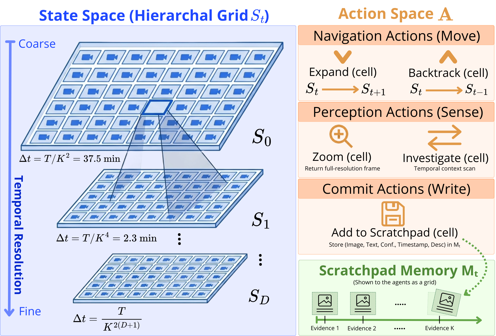
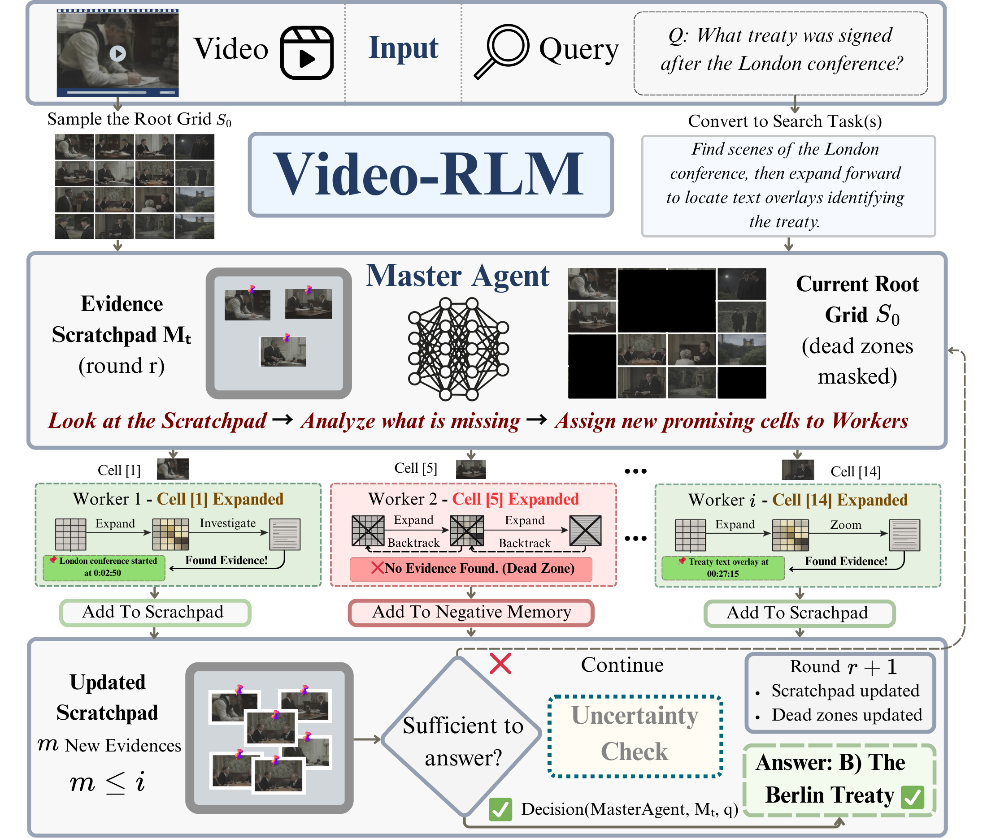
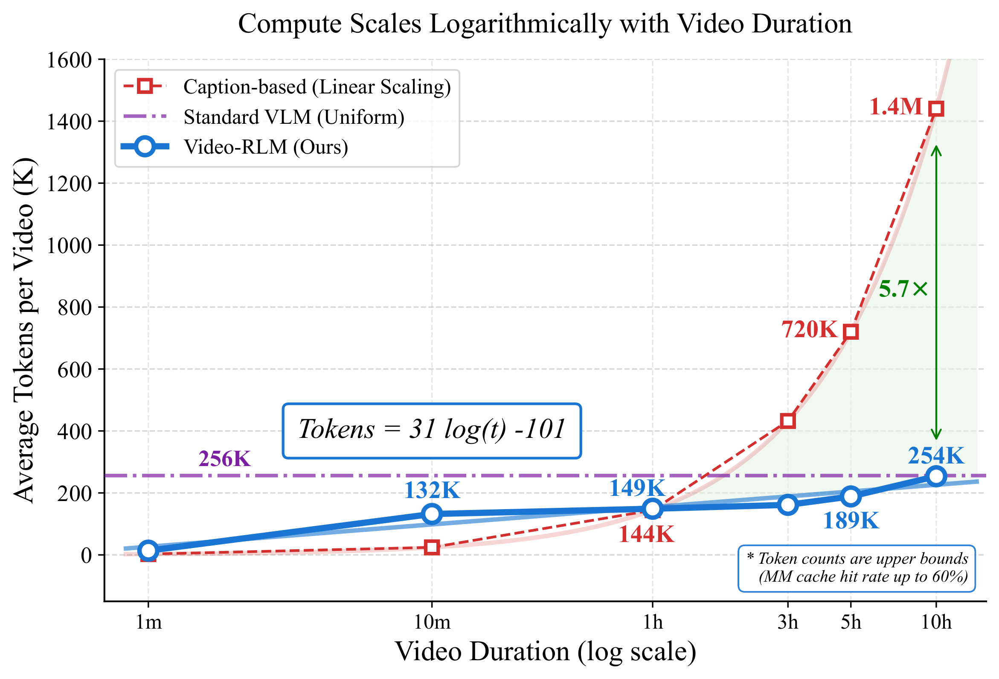
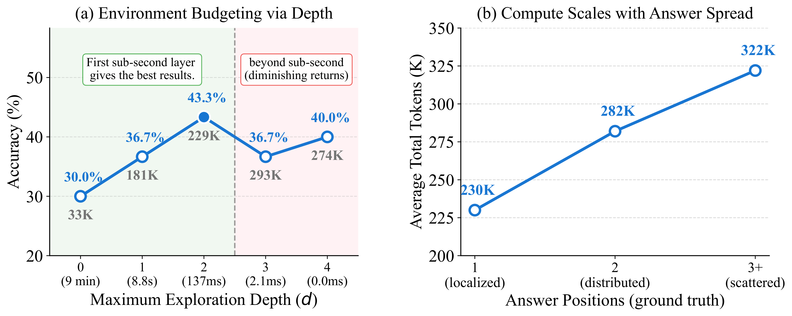
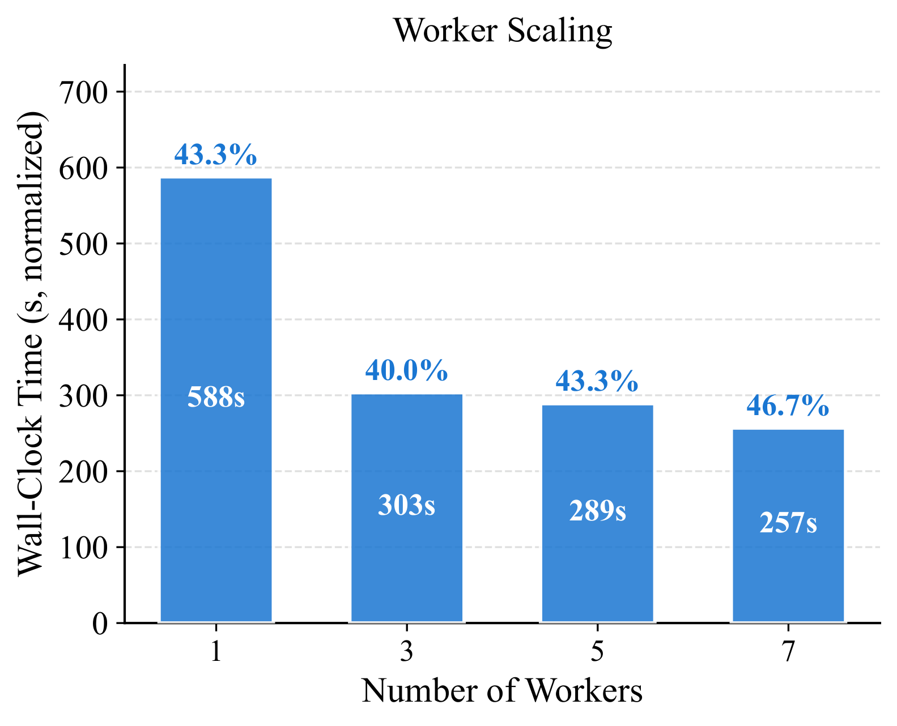

# VideoAtlas: Navigating Long-Form Video in Logarithmic Compute

**Authors:** Mohamed Eltahir, Ali Habibullah, Yazan Alshoibi, Lama Ayash, Tanveer Hussain and Naeemullah Khan

<div align="center">

[](https://arxiv.org)
</div>

<div align="center">
  
  <p><em>The VideoAtlas Environment. The state space is a hierarchical grid stack where the root grid covers the entire video. Deeper levels provide finer temporal resolution. Workers explore assigned subtrees concurrently while a Master steers exploration via uncertainty analysis.</em></p>
</div>

---

## Highlights

- **Lossless Hierarchical Representation**: VideoAtlas renders any video as a navigable K×K image grid — no captions, no offline preprocessing, no context ceiling. Any frame is reachable in O(log T) steps.
- **Video-RLM**: A parallel Master-Worker architecture extending Recursive Language Models to video. Workers explore grid subtrees concurrently and accumulate evidence in a lossless Visual Scratchpad, while a Master steers exploration via uncertainty analysis.
- **Logarithmic Compute Scaling**: As video duration grows 600×, compute grows sub-linearly. Video-RLM uses up to **5.7× fewer tokens** than linear-scaling caption baselines, further amplified by a **30–60% multimodal cache hit rate**.
- **Environment Budgeting**: Bounding the maximum exploration depth provides a principled compute-accuracy hyperparameter, directly controlling temporal resolution rather than frame quantity.
- **Emergent Adaptive Compute**: Scattered answers (3+ temporal positions) consume 40% more tokens than localized ones — without any explicit supervision.
- **VLM-Agnostic**: Works with any backbone (Qwen3.5, Gemini-3-Flash, etc.) without modifying the environment or coordination protocol.

---

## News

- **[2026]** Paper open sourced! 🎉

---

## Methodology

<div align="center">
  
  <p><em>Video-RLM overview. In each round, the Master examines the root grid (with dead zones masked) and the scratchpad, then assigns promising cells to Workers. Workers autonomously explore their regions. After all Workers return, memories are updated and the Master performs uncertainty analysis.</em></p>
</div>

### VideoAtlas Environment

At the core of VideoAtlas is a recursive K×K image grid (default K=8, yielding 64 cells). Given a video of duration T seconds:

- The **root grid S₀** renders the full video as a contact sheet — a bird's-eye view at a glance.
- **EXPAND** recursively zooms into any cell, increasing temporal resolution by K² per level.
- At depth d, temporal resolution is **Δtd = T / K^(2(d+1))**, reaching sub-second precision for 10-hour videos.
- Sub-grids are generated **on-the-fly** — no offline decoding, no RAM bottleneck.

### Action Space

| Category | Actions |
|----------|---------|
| **Navigation** | `EXPAND(cell)`, `BACKTRACK()`, `MARK_PROMISING(cells)` |
| **Perception** | `ZOOM(cell)`, `INVESTIGATE(cell, before/after)` |
| **Commit** | `ADD_TO_SCRATCHPAD(items)`, `FINISHED()` |

### Memory

- **Positive Memory (M⁺, Visual Scratchpad)**: Lossless multimodal evidence tuples — image patch, subtitle, timestamp, confidence, description. Rendered as a labeled grid for cross-referencing.
- **Negative Memory (M⁻, Dead Zones)**: Explored intervals with no findings are blacked out in the grid, physically preventing hallucination over already-explored regions.

---

## Results

<div align="center">
  
  <p><em>Logarithmic compute scaling with video duration. Video-RLM's hierarchical grid grows sub-linearly O(log T), requiring up to 5.7× fewer tokens than linear-scaling baselines at 10-hour duration.</em></p>
</div>

### Standard Benchmarks (Long subsets)

| Method | Active Params | LVB | VMME |
|--------|:---:|:---:|:---:|
| GPT-4o | Prop. | 66.7 | 65.3 |
| GPT-5 | Prop. | 72.6 | 81.8 |
| Gemini-3-Flash | Prop. | 74.5 | — |
| Claude-Opus-4.5 | Prop. | 67.2 | 77.6 |
| InternVL3.5-241B | 28B | 67.1 | 72.9 |
| GLM-4.5V-106B | 12B | **76.7** | 74.6 |
| MR.Video (Gemini+GPT-4o) | Prop. | 61.6 | 61.8 |
| VideoARM (GPT-o3+GPT-4o) | Prop. | 76.4 | **81.2** |
| Qwen3.5 (uniform, 160 fr.) | 3B | 61.5 | 63.8 |
| LLM over Captions | Prop.+3B | 62.4 | 64.2 |
| **Video-RLM (Qwen3.5-35B)** | **3B** | 52.5 | 50.4 |
| **Video-RLM (Gemini-3-Flash)** | **Prop.** | **72.0** | **76.2** |

### 10-Hour Variants

| Method | LVB-10hr Acc. | Δ | Tokens | LVB Eff.↑ | VMME-10hr Acc. | Δ | Tokens | VMME Eff.↑ |
|--------|:---:|:---:|:---:|:---:|:---:|:---:|:---:|:---:|
| Qwen3.5 (uniform) | 49.2 | -12.3 | 212K | 23.2 | 50.6 | -13.2 | 232K | 21.8 |
| LLM over Captions | 62.1 | **-0.3** | 207K | 30.0 | 36.0 | -28.2 | 235K | 15.3 |
| **Video-RLM (Qwen)** | 47.7 | -4.8 | 250K | 27–48† | 49.7 | **-0.7** | 625K | 11–20† |
| **Video-RLM (Gemini)** | **70.1** | -1.9 | 352K | **28–50†** | **69.1** | -7.1 | 323K | **31–54†** |

> Eff. = accuracy per 100K effective tokens. †Assumes 30–60% prefix-cache hit rate for Video-RLM.

<div align="center">
  
  <p><em>Left: Environment budgeting — accuracy and tokens vs. max depth on LVB-10hr. Green marks the optimal depth (first sub-second layer). Right: Adaptive compute — average tokens scale with evidence spread without ground-truth supervision.</em></p>
</div>

<div align="center">
  
  <p><em>Worker scaling: wall-clock time (normalized) vs. number of workers on LVB-10hr. Accuracy (annotated) remains stable across all configurations while throughput improves 2.25× from 2 to 8 workers.</em></p>
</div>

---

## 🧩 Prerequisites

- Python **3.8+**
- **Gemini API key** ([Google AI Studio](https://aistudio.google.com)) or **Vertex AI** access (service account JSON)
- `ffmpeg` installed and on PATH (for subtitle extraction)

---

## ⚙️ Installation

```bash
# Clone the repository
git clone https://github.com/mohammad2012191/VideoAtlas.git
cd VideoAtlas

# Create and activate a virtual environment
python -m venv .venv
source .venv/bin/activate      # Linux / macOS
.venv\Scripts\activate         # Windows

# Install dependencies
pip install -r requirements.txt
```

---

## Backend Configuration

Edit `config.py` to select your backend and model:

```python
# Use Google AI (Gemini API key)
BACKEND = "google"
GOOGLE_API_KEY = "your-api-key-here"

# Or use Vertex AI (service account JSON)
BACKEND = "vertex"
SERVICE_ACCOUNT_FILE = "vertex_key.json"
```

Key parameters in `config.py`:

| Parameter | Description | Default |
|-----------|-------------|---------|
| `GRID_K` | Grid size (K×K cells) | `8` |
| `EXPLORE_MODE` | `"auto"`, `"dfs"`, or `"bfs"` | `"dfs"` |
| `NUM_CALLS` | Total VLM call budget | `512` |
| `BUDGET_PER_CELL` | Steps per worker per cell | `8` |
| `DFS_MAX_DEPTH` | Max exploration depth (`"auto"` = stop at <1s span) | `"auto"` |
| `NUM_GPUS` | Number of parallel workers | `4` |

---

## Usage

### Single Video Q&A

```bash
python main.py
```

You will be prompted for:
- **Video file path** — any format supported by OpenCV/ffmpeg
- **Subtitle JSON path** — optional, leave blank to skip
- **Question** — supports both multiple-choice and open-ended questions
- **Answer options** — enter one per line, or press Enter immediately to use open-ended mode

**Multiple-choice example:**
```
Video file path: videos/lecture.mp4
Subtitle JSON path: subtitles/lecture_eng.json
Question: What topic is discussed at the beginning?
  Option 0: Machine learning
  Option 1: Computer vision
  Option 2: Natural language processing
  Option 3:              ← press Enter to finish
```

**Open-ended example:**
```
Video file path: videos/documentary.mp4
Subtitle JSON path:     ← press Enter to skip
Question: Summarize the main events that occur in the video.
  Option 0:             ← press Enter immediately for open-ended mode
```

---

## Subtitle Extraction

Extract embedded subtitle tracks from a video and save as JSON (compatible with the pipeline):

```bash
# Auto-detect and extract subtitles
python extract_subtitles.py --video myvideo.mp4

# List available subtitle tracks
python extract_subtitles.py --video myvideo.mp4 --list

# Extract a specific track
python extract_subtitles.py --video myvideo.mp4 --track 1 --output subs.json
```

Subtitle JSON files are saved to the `subtitles/` folder by default.

---

## Replay Visualization

Generate a replay video from a completed run's debug images:

```bash
# Interactive mode
python visualize_run.py

# Direct mode
python visualize_run.py --run results/run_20260310_230348_images --fps 1.5

# With explicit result JSON
python visualize_run.py \
  --run results/run_20260310_230348_images \
  --result results/result_20260310_230348.json \
  --fps 1.0
```

The replay video shows:
- **Left panel**: The agent's frame-by-frame exploration in true run order
- **Right panel**: Live scratchpad with evidence thumbnails and per-item reasoning (description, confidence, subtitle)
- **Header**: Frame category, progress counter, and predicted answer overlay
- **End freeze**: Last frame held for 4 seconds for easy reading

---

## Output Structure

Each run produces the following in `results/`:

```
results/
├── run_<timestamp>.log               # Full verbose log
├── result_<timestamp>.json           # Predicted answer + metrics
└── run_<timestamp>_images/
    ├── 0001_global_grid.jpg          # Root grid (master overview)
    ├── 0002_W1_C0_step0.jpg          # Worker 1, Cell 0, Step 0
    ├── ...
    ├── 0051_scratchpad_5items.jpg    # Evidence grid image
    ├── 0051_scratchpad_5items_reasoning.json  # Per-item reasoning sidecar
    └── replay.mp4                    # Auto-generated replay video
```

### Result JSON Schema

```json
{
  "question": "How many yellow cards were shown?",
  "candidates": ["3", "5", "8", "9"],
  "predicted_choice": 2,
  "predicted_answer": "8",
  "reasoning": "Evidence [A] at 803.8s shows a referee holding a yellow card...",
  "metrics": {
    "vlm_calls": 24,
    "total_tokens": 185400,
    "frames_decoded": 512,
    "coverage_pct": 38.5,
    "wall_time_s": 513.8,
    "mode_used": "DFS"
  }
}
```

---

## Limitations

1. **VLM bottleneck**: The perceptual ceiling is set by the backbone VLM. Fine-grained distinctions (small text, similar actions) remain challenging regardless of environment resolution.
2. **Evaluation scope**: Currently validated on multiple-choice and open-ended QA. The MDP formulation supports temporal grounding, summarization, and anomaly detection, but these are not yet empirically demonstrated.
3. **Zero-shot only**: The MDP is solved entirely via zero-shot VLM reasoning. The discrete, finite action space makes VideoAtlas compatible with RL training (PPO, DQN), which is left to future work.

---

## Citation

If you use VideoAtlas in your research, please cite:

```bibtex
@inproceedings{eltahir2026videoatlas,
  title     = {VideoAtlas: Navigating Long-Form Video in Logarithmic Compute},
  author    = {Eltahir, Mohamed and Habibullah, Ali and Alshoibi, Yazan and
               Ayash, Lama and Hussain, Tanveer and Khan, Naeemullah},
  booktitle = {TBD},
  year      = {2026}
}
```